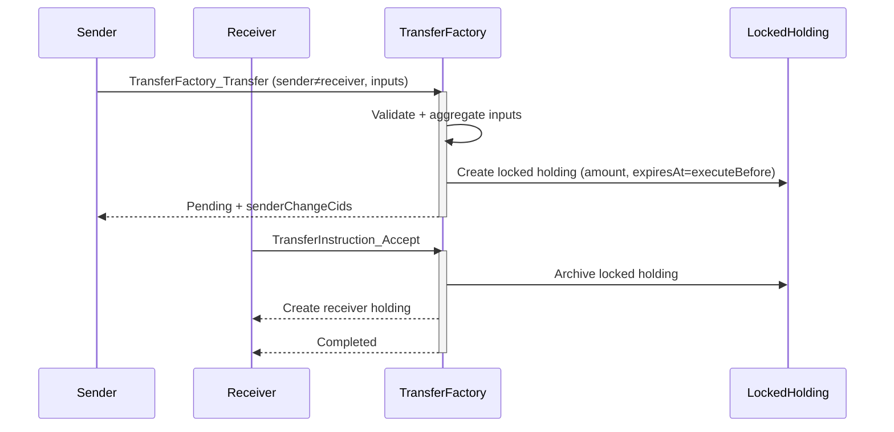
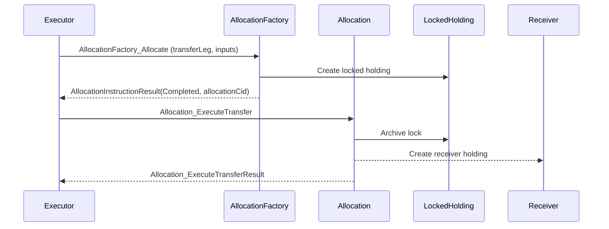

# Fungible Token (CIP‑0056) on Canton

This repository contains a minimal, standards‑compliant implementation of the Canton Network token standard CIP‑0056 for fungible tokens, plus a test package and example integration with the Splice Amulet reference.

The code demonstrates both direct (single‑step) transfers and two‑step, pending‑acceptance transfers with pre‑locked inputs, as well as DvP allocations in line with the standard’s allocation APIs.

## Status and compatibility

- **Interfaces implemented**: `HoldingV1`, `TransferInstructionV1` (`TransferFactory` + `TransferInstruction`), `AllocationInstructionV1` (`AllocationFactory`), `AllocationV1`.
- **Two transfer modes**:
  - **Single‑step**: used when sender == receiver (self‑transfer) for simple merge/split operations.
  - **Two‑step**: used when sender != receiver; inputs are aggregated and pre‑locked at instruction creation. Receiver later accepts or rejects.
- **Metadata**: uses the open `MetadataV1` map; callers can set arbitrary token attributes (name, symbol, issued‑at, description, …).
- **Reference**: The test sources include Splice Amulet modules to compare against the richer reference implementation (fees/rewards/etc.).

## Repository layout

- [fungible-token](/fungible-token/) — main package implementing the CIP‑0056 interfaces
  - [daml/Fungible/TokenHolding.daml](/fungible-token/daml/Fungible/TokenHolding.daml)
  - [daml/Fungible/TokenTransferInstruction.daml](/fungible-token/daml/Fungible/TokenTransferInstruction.daml)
  - [daml/Fungible/TwoStepTransferInstruction.daml](/fungible-token/daml/Fungible/TwoStepTransferInstruction.daml)
  - [daml/Fungible/TokenTransferFactory.daml](/fungible-token/daml/Fungible/TokenTransferFactory.daml)
  - [daml/Fungible/TokenAllocation.daml](/fungible-token/daml/Fungible/TokenAllocation.daml)
  - [daml/Fungible/TokenAllocationFactory.daml](/fungible-token/daml/Fungible/TokenAllocationFactory.daml)

- [fungible-token-test](/fungible-token-test) — Daml Script tests and helpers
  - [daml/FungibleTokenTest.daml](/fungible-token-test/daml/FungibleTokenTest.daml)
    - `setupToken`: shared test setup for parties, instrument and initial issuances
    - Tests for two‑step accept/reject/withdraw, expired single‑step, update‑failure, wrong admin, insufficient balance

- [external-test-sources/splice-token-standard-test](/external-test-sources/splice-token-standard-test) — upstream testing utilities and examples

## Prerequisites

- Daml SDK (as per package configs) — e.g. the snapshot in
  - [fungible-token/daml.yaml](/fungible-token/daml.yaml)
  - [fungible-token-test/daml.yaml](/fungible-token-test/daml.yaml)
- Canton or Sandbox for running scripts (tests use in‑memory test runner).

## Build

From the repository root (multi-package):

```bash
daml build --all
```

Or build packages individually:

```bash
cd fungible-token
daml build

cd ../fungible-token-test
daml build
```

## Run tests

- Run tests in the test DAR using the in‑memory test runner:

```bash
cd fungible-token-test
daml test --all
```

- Narrow to a specific file:

```bash
daml test --files daml/FungibleTokenTest.daml
```

## Concepts

### Instrument

- An instrument identifies a token type as `{ admin : Party, id : Text }` (see [HoldingV1](https://github.com/hyperledger-labs/splice/blob/main/token-standard/splice-api-token-holding-v1/daml/Splice/Api/Token/HoldingV1.daml)).
- From the same code, multiple tokens (e.g., “USDC”, “USDT”) are created by using different `InstrumentId`s and admin parties.

### Metadata

- `MetadataV1` is an open key→value map (TextMap). You can attach business attributes such as name, symbol, issued‑at, description, etc., on factories, holdings, and results.
- Example (caller‑provided):

```haskell
import Splice.Api.Token.MetadataV1 as M
import DA.TextMap as TM

let tokenMeta = M.Metadata with
      values = TM.fromList
        [ ("token.example.org/name", "MyToken")
        , ("token.example.org/symbol", "MTK")
        , ("token.example.org/issued-at", "2025-08-21T12:34:56Z")
        ]
```

### Transfers

- Single‑step (self‑transfers): [TokenTransferInstruction.daml](/fungible-token/daml/Fungible/TokenTransferInstruction.daml)
  - Inputs are validated and archived at accept time; sender change and receiver holdings are created immediately.
- Two‑step (pending acceptance, sender ≠ receiver): [TwoStepTransferInstruction.daml](/fungible-token/daml/Fungible/TwoStepTransferInstruction.daml)
  - Inputs are aggregated, archived, and converted into a single locked holding at instruction creation; receiver later accepts (consumes lock, creates receiver holding) or rejects/withdraws (returns funds to sender).

### DvP allocations

- Lock funds into an allocation and settle/cancel/withdraw via [TokenAllocationFactory.daml](/fungible-token/daml/Fungible/TokenAllocationFactory.daml) and [TokenAllocation.daml](/fungible-token/daml/Fungible/TokenAllocation.daml).

## Usage examples

### Create a transfer instruction (factory call)

```haskell
let extraArgs = MetaV1.ExtraArgs with
      meta = tokenMeta
      context = MetaV1.emptyChoiceContext

exerciseCmd (toInterfaceContractId @TransferInstrV1.TransferFactory transferFactoryCid)
  TransferInstrV1.TransferFactory_Transfer with
    expectedAdmin = admin
    transfer = TransferInstrV1.Transfer with
      sender
      receiver
      amount
      instrumentId
      requestedAt
      executeBefore
      inputHoldingCids
      meta = tokenMeta
    extraArgs
```

### Accept or reject a pending transfer

```haskell
exerciseCmd instrCid TransferInstrV1.TransferInstruction_Accept with extraArgs
-- or
exerciseCmd instrCid TransferInstrV1.TransferInstruction_Reject with extraArgs
```

## Sequence diagrams

### Two‑step transfer



### Allocation (DvP) settlement



## Development notes

- Two‑step instruction creation lives in [TokenTransferFactory.daml](/fungible-token/daml/Fungible/TokenTransferFactory.daml). The factory decides between single‑step and two‑step:
  - sender == receiver ⇒ single‑step (`TokenTransferInstruction`)
  - sender ≠ receiver ⇒ two‑step (`TokenTwoStepTransferInstruction`), with a pre‑locked holding

- Tests are organized in [FungibleTokenTest.daml](/fungible-token-test/daml/FungibleTokenTest.daml). Use `setupToken` to initialize parties, an instrument and initial balances for each test.

## License

The implementation builds on interfaces and test sources that are Apache‑2.0 licensed. See headers in the referenced files for details.
