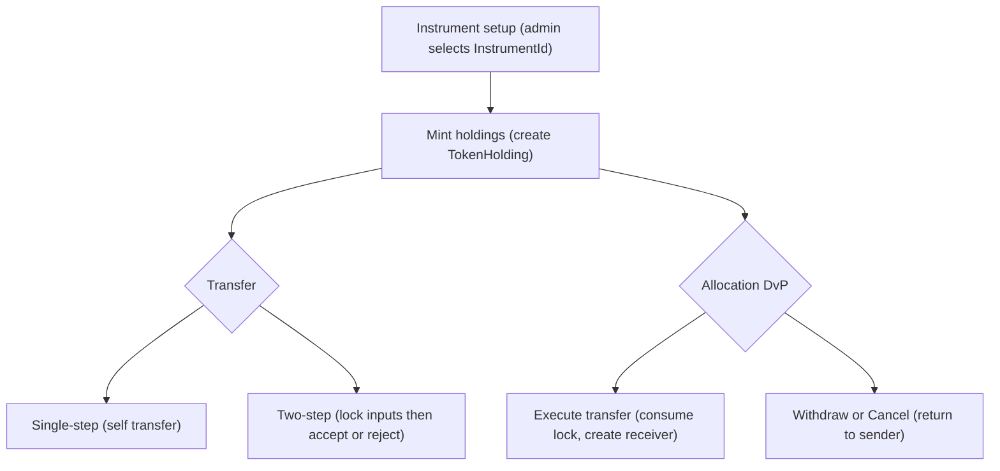
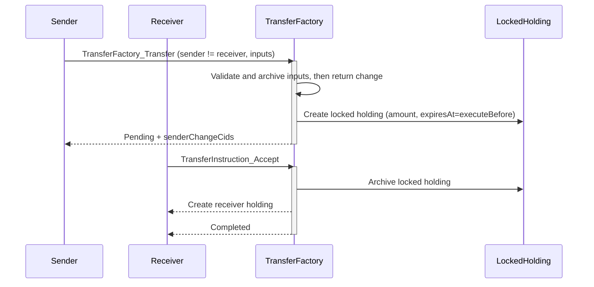
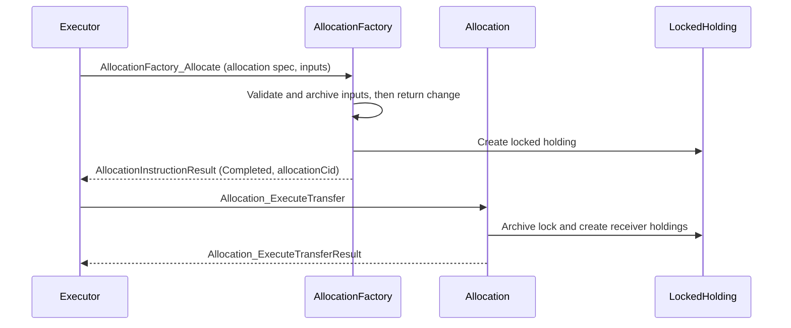

# Token lifecycle overview

This document explains the end‑to‑end lifecycle of a fungible token that adheres to the Canton token standard CIP‑0056, as implemented in this repository. It covers instruments, issuance, transfers (single‑step and two‑step), DvP allocations, metadata, and failure/edge cases.

## Actors and core data

- **Admin (registry/issuer)**: Governs an instrument; owns factories and authorizes operations
- **Sender / Receiver**: Token holders transacting funds
- **Executor (for DvP)**: Application/venue coordinating multi‑leg settlements

Key types (from the standard):

- **InstrumentId** = `{ admin : Party, id : Text }` — identifies a token type
- **Holding** — interface view with `{ owner, instrumentId, amount, lock, meta }`
- **Metadata** — open TextMap for arbitrary key/value attributes
- **Lock** — `{ holders, expiresAt|expiresAfter, context }`

References:

- [fungible-token/daml/Fungible/TokenHolding.daml](/fungible-token/daml/Fungible/TokenHolding.daml)
- [fungible-token/daml/Fungible/TokenTransferFactory.daml](/fungible-token/daml/Fungible/TokenTransferFactory.daml)
- [fungible-token/daml/Fungible/TokenTransferInstruction.daml](/fungible-token/daml/Fungible/TokenTransferInstruction.daml)
- [fungible-token/daml/Fungible/TwoStepTransferInstruction.daml](/fungible-token/daml/Fungible/TwoStepTransferInstruction.daml)
- [fungible-token/daml/Fungible/TokenAllocationFactory.daml](/fungible-token/daml/Fungible/TokenAllocationFactory.daml)
- [fungible-token/daml/Fungible/TokenAllocation.daml](/fungible-token/daml/Fungible/TokenAllocation.daml)

## Phase 1 — Instrument setup

- The admin defines an `InstrumentId` (e.g., id="USDC"). Multiple instruments can exist from the same code, each governed by its admin.
- Factories (transfer/allocation) are created by the admin and enforce that `expectedAdmin` matches.

Example setup (see `setupToken`):

```haskell
let instrumentId = HoldingV1.InstrumentId with admin; id = "TEST-USDC"
let tokenMeta = MetaV1.emptyMetadata
transferFactoryCid <- submit admin $ createCmd TokenTransferFactory with admin; meta = tokenMeta
```

## Phase 2 — Issuance (mint)

- Issuance is represented by creating on‑ledger holdings for owners.
- Each `TokenHolding` implements the `HoldingV1` interface; ensures amount > 0 and tags the instrument.

Example issuance:

```haskell
submitMulti [admin, alice] [] $ createCmd TokenHolding with
  admin; owner = alice; amount = 100.0; instrumentId; lock = None; meta = tokenMeta
```

## Phase 3 — Transfers

### Single‑step transfer (self‑transfer)

- Applied when `sender == receiver`. This is a merge/split flow handled by [TokenTransferInstruction.daml](/fungible-token/daml/Fungible/TokenTransferInstruction.daml).
- Inputs are validated and archived at accept; any change is returned; result is Completed with receiver holding(s).

Initiation:

```haskell
exerciseCmd (toInterfaceContractId @TransferInstrV1.TransferFactory transferFactoryCid)
  TransferInstrV1.TransferFactory_Transfer with
    expectedAdmin = admin
    transfer = TransferInstrV1.Transfer with
      sender = alice; receiver = alice; amount = 1.0
      instrumentId; requestedAt = now; executeBefore = later
      inputHoldingCids = cids; meta = tokenMeta
    extraArgs = MetaV1.ExtraArgs with meta = tokenMeta; context = MetaV1.emptyChoiceContext
```

Acceptance:

```haskell
exerciseCmd instrCid TransferInstrV1.TransferInstruction_Accept with extraArgs
```

Expiry:

- If `executeBefore` is in the past at accept time, Accept fails.

### Two‑step transfer (pending acceptance)

- Applied when sender != receiver. Implemented by [TokenTransferFactory.daml](/fungible-token/daml/Fungible/TokenTransferFactory.daml) and [TwoStepTransferInstruction.daml](/fungible-token/daml/Fungible/TwoStepTransferInstruction.daml).
- At instruction creation:
  - Validates specified inputs belong to sender, unlocked, and match instrument
  - Archives inputs; returns change immediately to sender (if any)
  - Creates a single locked holding for `transfer.amount` with lock holders `[instrument admin]` and `expiresAt=executeBefore`
  - Creates a `TokenTwoStepTransferInstruction` referencing this locked holding
- At acceptance:
  - Archives the locked holding
  - Creates a receiver holding for `transfer.amount`
- Reject/Withdraw:
  - Archives the locked holding; returns unlocked funds to sender; result Failed

Typical flow:

```haskell
-- 1) Initiate (sender)
let res : TransferInstrV1.TransferInstructionResult =
  submitWithDisclosures' sender disc $ exerciseCmd
    (toInterfaceContractId @TransferInstrV1.TransferFactory transferFactoryCid)
    TransferInstrV1.TransferFactory_Transfer with {expectedAdmin=admin, transfer, extraArgs}

-- 2) Accept (receiver)
exerciseCmd instrCid TransferInstrV1.TransferInstruction_Accept with extraArgs

-- Alternative paths
exerciseCmd instrCid TransferInstrV1.TransferInstruction_Reject with extraArgs
exerciseCmd instrCid TransferInstrV1.TransferInstruction_Withdraw with extraArgs
```

Notes:

- `TransferInstruction_Update` is intentionally not implemented in this minimal registry; calls will fail.

## Phase 4 — DvP allocations

Implemented by [TokenAllocationFactory.daml](/fungible-token/daml/Fungible/TokenAllocationFactory.daml) and [TokenAllocation.daml](/fungible-token/daml/Fungible/TokenAllocation.daml).

1) Allocate (executor/venue):
   - Validate `expectedAdmin`, timing
   - Aggregate specified inputs; archive them
   - Create change to sender (if any)
   - Create locked holding for the leg’s amount and a `TokenAllocation` referencing it

2) Execute transfer:
   - `Allocation_ExecuteTransfer` archives the locked holding and creates receiver holding(s)

3) Withdraw/Cancel:
   - Archives the locked holding and returns unlocked holding(s) to the sender; result indicates withdrawal/cancellation

Example (allocate):

```haskell
exerciseCmd (toInterfaceContractId @AllocInstrV1.AllocationFactory allocFactoryCid)
  AllocInstrV1.AllocationFactory_Allocate with
    expectedAdmin = admin
    allocation = spec
    inputHoldingCids
    requestedAt = now
    extraArgs = MetaV1.ExtraArgs with meta = tokenMeta; context = MetaV1.emptyChoiceContext
```

## Metadata lifecycle

- Callers set `extraArgs.meta` at factory/choice time.
- The implementation propagates `meta` to created holdings and result views.
- Recommended to use namespaced keys (e.g., `token.example.org/name`).

## Invariants and validation

- Holding amount > 0
- Instruments must match across inputs/outputs
- Only admin‑governed instrument can be used with a given factory (expectedAdmin checks)
- Time checks: `executeBefore` in the future for initiation; lock `expiresAt` derived from it
- Lock required for two‑step path; must be held by admin; must be consumed before receiver holding creation

## Failure and edge cases

- Insufficient balance at two‑step initiation ⇒ factory choice fails
- Expired execution at accept time ⇒ accept fails
- Wrong expectedAdmin ⇒ factory choice fails
- Update choice ⇒ fails (not implemented)
- Reject/Withdraw on two‑step ⇒ returns funds to sender; result Failed

## Test coverage

See [fungible-token-test/daml/FungibleTokenTest.daml](/fungible-token-test/daml/FungibleTokenTest.daml):

- `setupToken`: shared initializer for parties, instrument, issuances
- `testFungibleIssuanceAndTransfer`: issuance, two‑step/single‑step transfers, balances
- `testTwoStepReject`: receiver rejects pending instruction
- `testTwoStepWithdraw`: sender withdraws pending instruction
- `testSingleStepExpiredAccept`: accept fails after expiry for single‑step
- `testTransferUpdateNotImplemented`: Update choice fails
- `testFactoryWrongAdmin`: expectedAdmin mismatch
- `testTwoStepInsufficientBalance`: failing two‑step initiation

## Sequence diagrams

### End‑to‑end token lifecycle



### Two‑step transfer



### Allocation (DvP)


