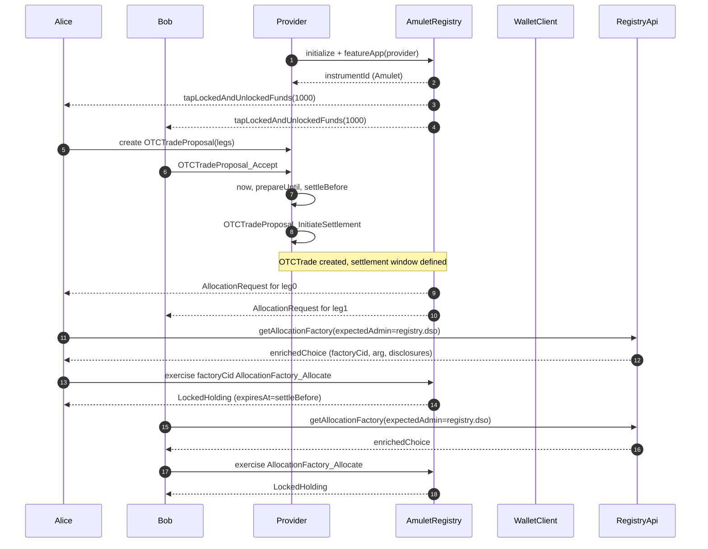
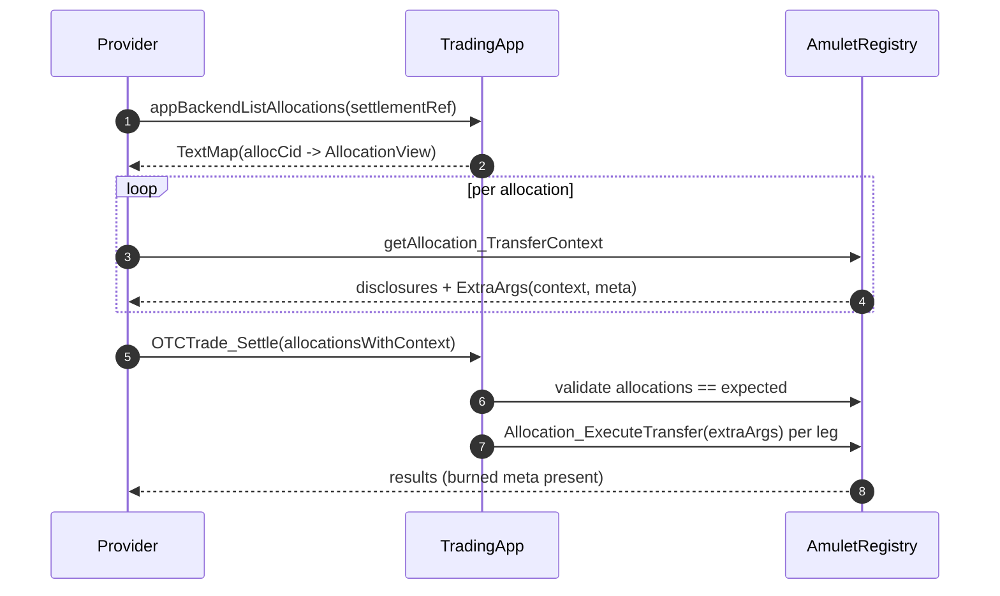
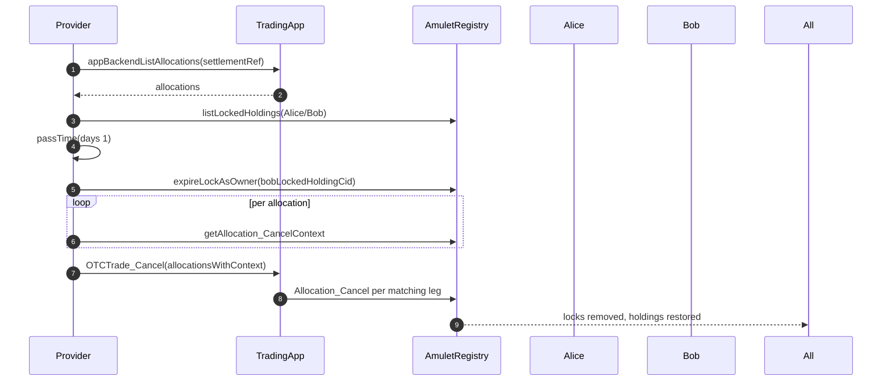
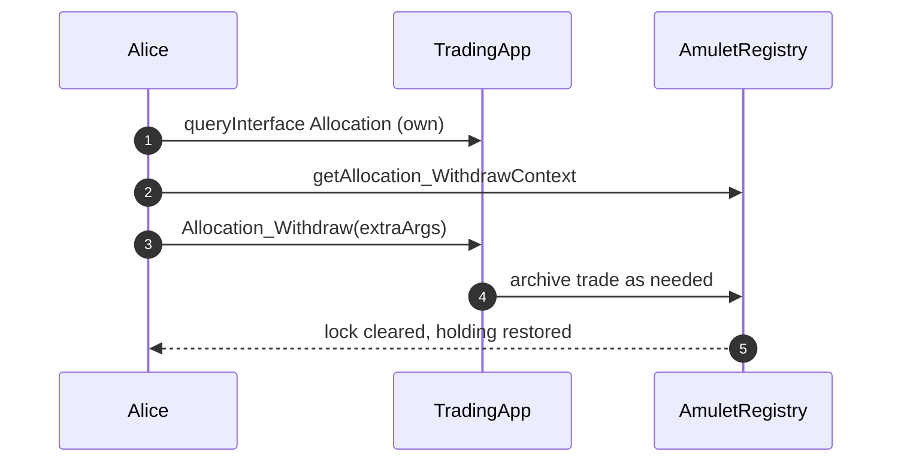

# Amulet DvP Test Workflow and Sequence Diagrams

This document explains the end-to-end DvP (Delivery versus Payment) test flows implemented in `Splice.Tests.TestAmuletTokenDvP` and the supporting `Splice.Testing.Apps.TradingApp` module. It covers setup, settlement, cancellation, and withdrawal workflows, with sequence diagrams and references to key DAML modules.

- **Primary test**: [TestAmuletTokenDvP.daml](/external-test-sources/splice-token-standard-test/daml/Splice/Tests/TestAmuletTokenDvP.daml)
- **Trading app logic**: [TradingApp.daml](/external-test-sources/splice-token-standard-test/daml/Splice/Testing/Apps/TradingApp.daml)
- **Registry integration helpers**: [RegistryApi.daml](/external-test-sources/splice-token-standard-test/daml/Splice/Testing/TokenStandard/RegistryApi.daml)
- **Wallet utilities**: [WalletClient.daml](/external-test-sources/splice-token-standard-test/daml/Splice/Testing/TokenStandard/WalletClient.daml)

## Actors and Components

- **alice, bob**: Trading parties.
- **provider**: Venue/operator of the OTC trading app.
- **AmuletRegistry**: Registry for the Amulet token; issues, locks, and manages holdings.
- **WalletClient**: Helper utilities to list holdings, allocations, and submit choices from the perspective of a party.
- **RegistryApi**: Helper utilities to retrieve allocation factories and choice contexts for registry-driven operations.
- **OTCTradeProposal / OTCTrade**: Trading app templates that orchestrate DvP flows.

## High-level Flow

1. Initialize Amulet registry and parties, feature the trading app provider, and fund parties.
2. Create transfer legs for an OTC trade; alice proposes, bob accepts.
3. Provider initiates the settlement window; registry emits allocation requests.
4. Senders accept allocation requests via registry allocation factories; locked holdings are created.
5. Provider aggregates allocations and settles, causing token transfers, metadata updates, and fee coupons.
6. Alternative paths: provider cancels settlement or a party withdraws before settlement.

## Test 1: Minimal Demo (testAmuletDvP)

Demonstrates basic end-to-end interaction: setup, propose, accept. See: `testAmuletDvP` in [TestAmuletTokenDvP.daml](/external-test-sources/splice-token-standard-test/daml/Splice/Tests/TestAmuletTokenDvP.daml).

- Initialize registry and capture `instrumentId`.
- Feature app provider and fund parties (`tapLockedAndUnlockedFunds`).
- Build two legs (alice→bob, bob→alice) and propose trade; bob accepts.

## Test 2: Full DvP Happy Path (testDvP)

End-to-end DvP including allocation acceptance by senders and final settlement by provider. See: `setupOtcTrade` and `testDvP` in [TestAmuletTokenDvP.daml](/external-test-sources/splice-token-standard-test/daml/Splice/Tests/TestAmuletTokenDvP.daml) and `OTCTrade` choices in [TradingApp.daml](/external-test-sources/splice-token-standard-test/daml/Splice/Testing/Apps/TradingApp.daml).

### 2.1 Setup and Allocation Creation (setupOtcTrade)

- Initialize registry, feature provider, fund `alice` and `bob`.
- Create transfer legs; `alice` proposes an OTC trade; `bob` accepts.
- Provider initiates settlement with timing constraints (`prepareUntil`, `settleBefore`).
- Registry emits allocation requests (one per leg) for the senders.
- Wallet view: `listRequestedAllocations` shows requests to senders.
- Sender validates the allocation factory admin and exercises allocation to create locked holdings.

Key validations during setup:

- Wrong admin must fail (negative test for `expectedAdmin`).
- Locked holding has expected lock context, holders, and expiry (`settleBefore`).

### 2.2 Provider Settles (OTCTrade_Settle)

- Provider aggregates allocations by `settlementRef` using `appBackendListAllocations`.
- For each allocation, obtain transfer context and disclosures, then execute `OTCTrade_Settle`.
- The `OTCTrade` choice validates each allocation matches the expected `AllocationSpecification` before executing `Allocation_ExecuteTransfer`.

Post-conditions verified in the test:

- Metadata contains the burn key (`expectBurn`).
- Holdings: `alice` has 20.0, `bob` has 100.0 of Amulet; balances approximate due to fees.
- Provider receives featured app reward coupons, distributed to beneficiaries as configured.

## Test 3: Provider Cancels (testDvPCancel)

Provider cancels the pending settlement; locked holdings unwind to original holdings.

- Provider enumerates allocations (`appBackendListAllocations`).
- Inspect locked holdings for both parties.
- Advance time (`passTime`) to exceed `settleBefore` and cause expiry path; additionally, expire bob’s lock as owner to cover mixed-state case.
- For each allocation, obtain cancel context and exercise `OTCTrade_Cancel` which calls `Allocation_Cancel` for matching legs.
- Validate no locked holdings remain; original amounts are present; no `Allocation` interfaces remain.

## Test 4: Sender Withdraws (testDvPWithdraw)

Alice withdraws her allocation before settlement; lock removed and funds restored.

- After setup, alice queries her `Allocation` and requests a withdraw context.
- Alice exercises `Allocation_Withdraw` via `OTCTrade` interface’s `allocationRequest_WithdrawImpl` behavior.
- Post-conditions: no locked holdings for alice; original holding amount restored; no `Allocation` interfaces remain for alice.
- Additional step: pass time and expire bob’s lock to cover other side.

## TradingApp Contract Logic Highlights

- `OTCTradeProposal`
  - `OTCTradeProposal_Accept`: Enforces approver is a trading party and unique.
  - `OTCTradeProposal_InitiateSettlement`: Checks all parties approved; `prepareUntil < settleBefore`; creates `OTCTrade` with settlement window.

- `OTCTrade`
  - `OTCTrade_Settle`: Validates time and that provided allocations match expected specs; executes `Allocation_ExecuteTransfer` per leg.
  - `OTCTrade_Cancel`: Optionally cancels matching allocations via `Allocation_Cancel`.
  - `AllocationRequest` interface instance: Defines `settlement` info and `transferLegs`; reject/withdraw behaviors are minimal in tests.

## Key Checks and Negative Tests

- **Admin validation**: Using a non-admin party to allocate must fail.
- **Metadata**: After execute/cancel paths, metadata must include burn marker (`burnedMetaKey`).
- **Locks**: Locked holdings must reflect expected lock context (holders, expiry, and context string tying back to leg id and receiver).

## Running the Tests

- Run the DAML script tests as you normally execute the test suite for this repo; this document explains the expected interactions and assertions.
- Refer to: [TestAmuletTokenDvP.daml](/external-test-sources/splice-token-standard-test/daml/Splice/Tests/TestAmuletTokenDvP.daml)

## References

- Test module: [TestAmuletTokenDvP.daml](/external-test-sources/splice-token-standard-test/daml/Splice/Tests/TestAmuletTokenDvP.daml)
- Trading app: [TradingApp.daml](/external-test-sources/splice-token-standard-test/daml/Splice/Testing/Apps/TradingApp.daml)
- Registry helpers: [RegistryApi.daml](/external-test-sources/splice-token-standard-test/daml/Splice/Testing/TokenStandard/RegistryApi.daml)
- Wallet helpers: [WalletClient.daml](/external-test-sources/splice-token-standard-test/daml/Splice/Testing/TokenStandard/WalletClient.daml)
