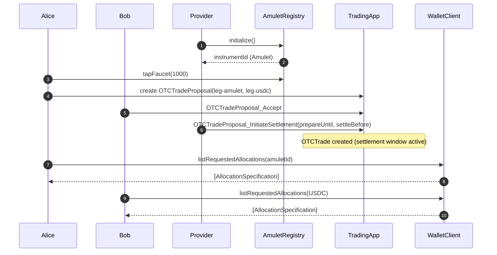
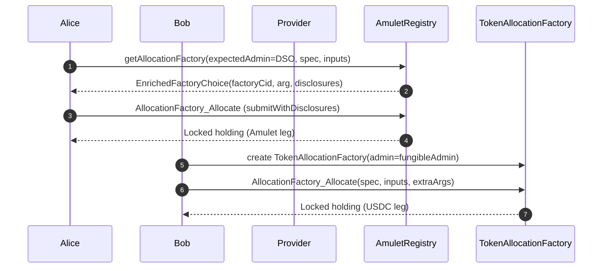
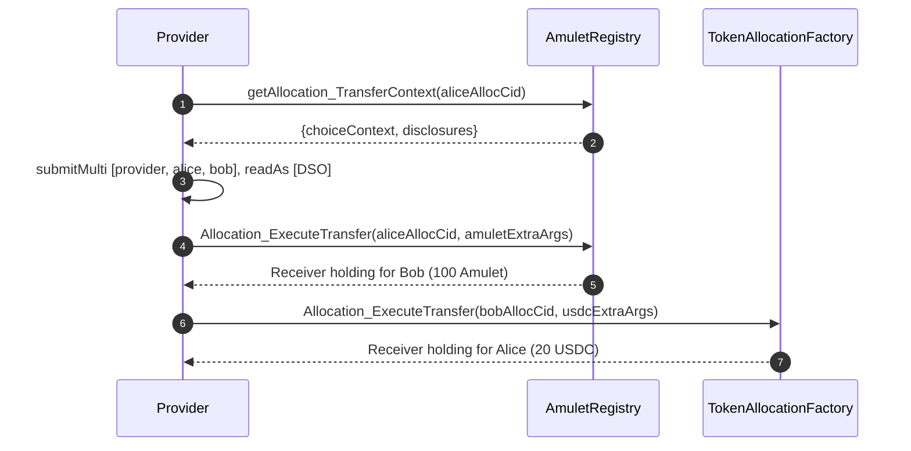

# Amulet ↔ Fungible (USDC) Swap Workflow and Sequence Diagrams

This document describes the end-to-end swap between Amulet and a Fungible token (USDC) as implemented in `Tests.TestAmuletFungibleSwap`. The flow uses the token standard’s allocation model and the example `TradingApp` to coordinate multi-leg Delivery-versus-Payment (DvP) semantics.

- Test script: [TestAmuletFungibleSwap.daml](/fungible-token-test/daml/Tests/TestAmuletFungibleSwap.daml)
- Trading app: [TradingApp.daml](/external-test-sources/splice-token-standard-test/daml/Splice/Testing/Apps/TradingApp.daml)
- Amulet registry helpers: [AmuletRegistry.daml](/external-test-sources/splice-token-standard-test/daml/Splice/Testing/Registries/AmuletRegistry.daml)
- Registry API helpers: [RegistryApi.daml](/external-test-sources/splice-token-standard-test/daml/Splice/Testing/TokenStandard/RegistryApi.daml)
- Wallet utilities: [WalletClient.daml](/external-test-sources/splice-token-standard-test/daml/Splice/Testing/TokenStandard/WalletClient.daml)
- Fungible allocation factory: [TokenAllocationFactory.daml](/fungible-token/daml/Fungible/TokenAllocationFactory.daml)
- Shared setup helpers: [Utils.daml](/fungible-token-test/daml/Shared/Utils.daml)

## Actors and Components

- User (alice): Onboarded on the provider’s node; taps Amulet faucet.
- Liquidity Provider (bob): Holds and allocates USDC (Fungible token).
- ExchangeApp Provider (provider): Venue/executor; coordinates trade and executes both legs.
- TradingApp: `OTCTradeProposal` and `OTCTrade` orchestrate the DvP.
- AmuletRegistry: Issues Amulet, provides allocation factories and execution contexts.
- Fungible TokenAllocationFactory: Allocates and executes USDC leg.

## High-level Workflow

1. Setup
   - Initialize Amulet registry; set `amuletId`.
   - Create USDC instrument and balances for bob via `setupToken`.
   - Onboard `provider` and `alice`; `alice` taps faucet for Amulet.
2. Propose trade using `TradingApp`
   - `alice` proposes OTC trade: `alice → bob`: 100 Amulet; `bob → alice`: 20 USDC.
   - `bob` accepts; `provider` initiates settlement window (creates `OTCTrade`).
3. Allocation requests appear to senders
   - `alice`: allocation required for Amulet.
   - `bob`: allocation required for USDC.
4. Allocate both legs
   - `alice` (Amulet): via `RegistryApi.getAllocationFactory` + `AllocationFactory_Allocate`.
   - `bob` (USDC): via `Fungible.TokenAllocationFactory` + `AllocationFactory_Allocate`.
5. Execute allocations
   - Amulet execution requires context (`amulet-rules`, `open-round`) and `readAs` DSO.
   - USDC execution requires no extra context.
6. Assertions
   - Alice receives 20 USDC; Bob receives 100 Amulet; no pending allocations for executor.

## Setup, Proposal, and Allocation Requests

## Allocation: Amulet and USDC

Notes:

- Amulet requires calling `RegistryApi.getAllocationFactory` to enrich the choice (context + disclosures) and allocating using the returned factory/arg.
- USDC allocation uses the local `TokenAllocationFactory` and passes `ExtraArgs` with `tokenMeta`; no special context is needed.

## Execution of Allocations (Swap)

Key execution details:

- Amulet execution must include the choice context (`amulet-rules`, `open-round`) and `readAs` the DSO so referenced registry state is visible.
- USDC execution runs without additional context.

## Important Validations and Visibility

- Expected admins must match:
  - Amulet: `expectedAdmin = amuletRegistry.dso`.
  - USDC: `expectedAdmin = fungibleAdmin`.
- Locked holding context strings identify leg and receiver (useful for debugging).
- Use `submitMulti [provider, alice, bob] [amuletRegistry.dso]` for Amulet execution.
- After execution, verify holdings using `WalletClient.checkHoldingWithAmountExists`.

## Running the Test

- Execute the DAML script: `Tests.TestAmuletFungibleSwap:testAmuletFungibleSwap`.
- The script handles setup, allocation, execution, and assertions.

## References

- Test script: [TestAmuletFungibleSwap.daml](/fungible-token-test/daml/Tests/TestAmuletFungibleSwap.daml)
- Trading app: [TradingApp.daml](/external-test-sources/splice-token-standard-test/daml/Splice/Testing/Apps/TradingApp.daml)
- Amulet registry: [AmuletRegistry.daml](/external-test-sources/splice-token-standard-test/daml/Splice/Testing/Registries/AmuletRegistry.daml)
- Registry API helpers: [RegistryApi.daml](/external-test-sources/splice-token-standard-test/daml/Splice/Testing/TokenStandard/RegistryApi.daml)
- Wallet utilities: [WalletClient.daml](/external-test-sources/splice-token-standard-test/daml/Splice/Testing/TokenStandard/WalletClient.daml)
- Fungible allocation factory: [TokenAllocationFactory.daml](/fungible-token/daml/Fungible/TokenAllocationFactory.daml)
- Shared setup helpers: [Utils.daml](/fungible-token-test/daml/Shared/Utils.daml)
