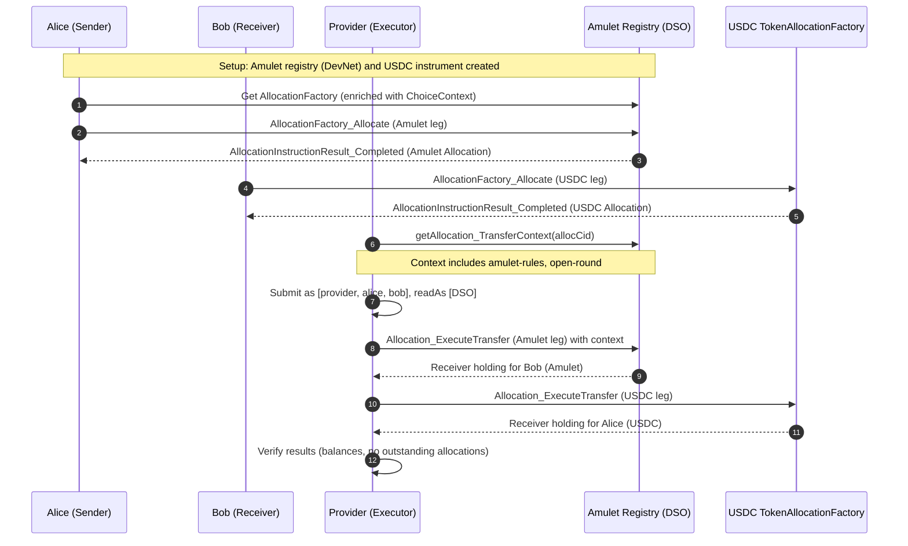

# DvP Test: Allocation-based Delivery-versus-Payment

This document explains the end-to-end Delivery-versus-Payment flow implemented by `testAllocationDvP` in [fungible-token-test/daml/Tests/AllocationDvPTest.daml](/fungible-token-test/daml/Tests/AllocationDvPTest.daml).

## Purpose

- Show how to allocate and settle two legs atomically across two assets:
  - Amulet (allocation and execution via the Amulet registry API)
  - USDC (allocation and execution via the local `Fungible` implementation)
- Demonstrate correct usage of metadata, disclosures, context requirements, and controller sets for each choice.

## Actors

- Sender (Alice): sends Amulet to Bob.
- Receiver (Bob): sends USDC to Alice.
- Executor (Provider): coordinates and executes the settlement legs.
- Registry Admin (DSO): `amuletRegistry.dso` for Amulet; `fungibleAdmin` for USDC.

## Key Files and Modules

- Test script: [fungible-token-test/daml/Tests/AllocationDvPTest.daml](/fungible-token-test/daml/Tests/AllocationDvPTest.daml)
- Fungible allocation factory: [fungible-token/daml/Fungible/TokenAllocationFactory.daml](/fungible-token/daml/Fungible/TokenAllocationFactory.daml)
- Fungible allocation implementation: [fungible-token/daml/Fungible/TokenAllocation.daml](/fungible-token/daml/Fungible/TokenAllocation.daml)
- Shared setup utilities: [fungible-token-test/daml/Shared/Utils.daml](/fungible-token-test/daml/Shared/Utils.daml)
- Registry testing helpers: [external-test-sources/splice-token-standard-test/daml/Splice/Testing/Registries/AmuletRegistry.daml](/external-test-sources/splice-token-standard-test/daml/Splice/Testing/Registries/AmuletRegistry.daml), [external-test-sources/splice-token-standard-test/daml/Splice/Testing/TokenStandard/RegistryApi.daml](/external-test-sources/splice-token-standard-test/daml/Splice/Testing/TokenStandard/RegistryApi.daml), [external-test-sources/splice-token-standard-test/daml/Splice/Testing/Utils.daml](/external-test-sources/splice-token-standard-test/daml/Splice/Testing/Utils.daml)

## High-level Workflow

1. Setup
   - Initialize Amulet registry (DevNet) and derive `amuletId`.
   - Create USDC instrument and initial balances via `setupToken` (Alice and Bob parties provided).
   - Allocate an Executor (`provider`).
   - Fund Alice with Amulet; fund Bob with USDC.

2. Build DvP legs
   - Leg 1 (Delivery): Alice → Bob (Amulet, e.g., 100.0)
   - Leg 2 (Payment): Bob → Alice (USDC, e.g., 20.0)
   - Construct a shared `SettlementInfo` with `executor`, timing windows, and metadata.

3. Allocate both legs
   - Alice allocates Amulet via the Amulet registry’s `AllocationFactory_Allocate` using
     `RegistryApi.getAllocationFactory` to enrich the choice with required disclosures and `ChoiceContext`
     (notably `amulet-rules` and `open-round`).
   - Bob allocates USDC via local `Fungible.TokenAllocationFactory` by exercising
     `AllocationFactory_Allocate` with his USDC input holdings.

4. Execute allocations (settlement)
   - Fetch the required OpenAPI execution context for the Amulet allocation via
     `RegistryApi.getAllocation_TransferContext` and pass it in `extraArgs`.
   - Execute the Amulet `Allocation_ExecuteTransfer` as `[provider, alice, bob]` with `readAs` including `amuletRegistry.dso` (for visibility of registry state referenced by context).
   - Execute the USDC `Allocation_ExecuteTransfer` as `[provider, alice, bob]` (no special context needed).

5. Assertions
   - Verify Alice received a USDC holding of the expected amount.
   - Optionally compute balances for both assets for both parties and log them.
   - Ensure no outstanding `Allocation` interface contracts remain for the executor.

## Sequence Diagram



## Important Details and Gotchas

- Required context for Amulet
  - Amulet choices expect a `ChoiceContext` containing at least `amulet-rules` and `open-round`.
  - The test obtains this by calling `RegistryApi.getAllocationFactory` (for allocate) and
    `RegistryApi.getAllocation_TransferContext` (for execute).

- Visibility when executing Amulet allocation
  - Execution references Amulet rules and rounds; these are not directly visible to `[provider, alice, bob]`.
  - Use `submitMulti [provider, alice, bob] [amuletRegistry.dso]` to include the DSO as `readAs`.

- Disclosures
  - The test uses `Splice.Testing.Utils.{queryDisclosure', submitWithDisclosures'}` to supply disclosures
    returned by the registry API enrichment helpers.

- Metadata
  - The USDC allocation and execution pass the fungible token metadata (`fungibleMetadata`) for observability.
  - The Amulet registry may add metadata such as burn amounts on results.

## Code Snippets

Allocate Amulet (Alice) via registry with enriched context:

```haskell
enrichedAlice <- RegistryApi.getAllocationFactory amuletRegistry AllocationInstructionV1.AllocationFactory_Allocate with
  expectedAdmin = amuletRegistry.dso
  allocation = aliceSpec
  requestedAt = now
  inputHoldingCids = aliceInputCids
  extraArgs = Splice.Testing.Utils.emptyExtraArgs

aliceResult <- Splice.Testing.Utils.submitWithDisclosures' alice enrichedAlice.disclosures $
  exerciseCmd enrichedAlice.factoryCid enrichedAlice.arg
```

Execute Amulet allocation with context and DSO readAs:

```haskell
aliceCtx <- RegistryApi.getAllocation_TransferContext amuletRegistry aliceAllocCid Api.Token.MetadataV1.emptyMetadata
let aliceExtraArgs = Api.Token.MetadataV1.ExtraArgs with
      meta = Api.Token.MetadataV1.emptyMetadata
      context = aliceCtx.choiceContext

_ <- submitMulti [provider, alice, bob] [amuletRegistry.dso] $ exerciseCmd
  aliceAllocCid
  AllocationV1.Allocation_ExecuteTransfer with
    extraArgs = aliceExtraArgs
```

Allocate USDC (Bob) and execute without special context:

```haskell
factoryCid <- submit fungibleAdmin $ createCmd TokenAllocationFactory with
  admin = fungibleAdmin
  meta = fungibleMetadata

factoryDisc <- Splice.Testing.Utils.queryDisclosure' @TokenAllocationFactory fungibleAdmin factoryCid
bobResult <- Splice.Testing.Utils.submitWithDisclosures' bob factoryDisc $
  exerciseCmd (toInterfaceContractId @AllocationInstructionV1.AllocationFactory factoryCid)
    AllocationInstructionV1.AllocationFactory_Allocate with
      expectedAdmin = fungibleAdmin
      allocation = bobSpec
      requestedAt = now
      inputHoldingCids = bobInputCids
      extraArgs = Api.Token.MetadataV1.ExtraArgs with
        meta = fungibleMetadata
        context = Api.Token.MetadataV1.emptyChoiceContext

_ <- submitMulti [provider, alice, bob] [] $ exerciseCmd
  bobAllocCid
  AllocationV1.Allocation_ExecuteTransfer with
    extraArgs = Api.Token.MetadataV1.ExtraArgs with
      meta = fungibleMetadata
      context = Api.Token.MetadataV1.emptyChoiceContext
```

## Design Choices

- Keep atomicity at the app layer
  - This example executes legs sequentially within the same high-level script, but each leg is executed separately.
  - In a full application, you could coordinate both executions in one submission command list if the registry permits batching, or employ an orchestration contract to enforce atomic semantics.

- Simple input selection
  - Inputs are selected by filtering unlocked holdings for the instrument. Real wallets may implement UTXO selection policies.

## Validation Checklist

- Alice receives a USDC holding with the agreed amount.
- Amulet and USDC allocations both complete successfully.
- No outstanding `Allocation` interface contracts are visible to the executor after execution.

## Troubleshooting

- “Missing context entry for: amulet-rules”
  - Ensure to call `RegistryApi.getAllocationFactory` (allocate) and
    `RegistryApi.getAllocation_TransferContext` (execute), and pass the returned `choiceContext` in `extraArgs`.

- “Attempt to fetch or exercise a contract not visible…”
  - Add `amuletRegistry.dso` to the `readAs` list in `submitMulti` for the Amulet execution step so the referenced registry state is visible.
